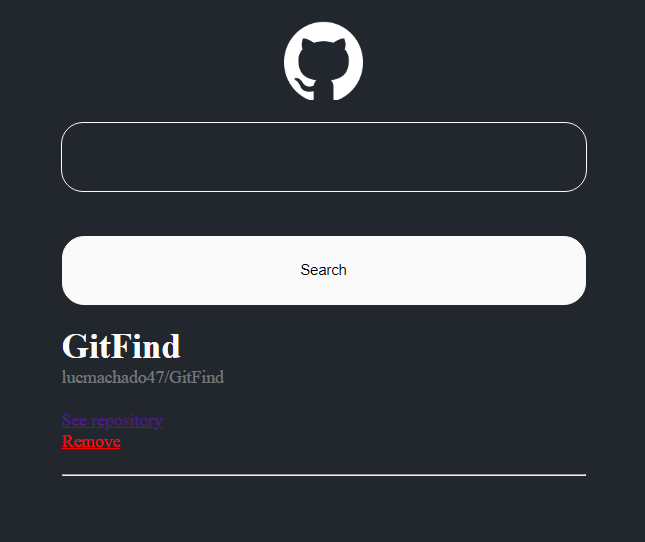

### GitHub Wiki

GitHub Wiki is a project developed with React JS and the GitHub REPOSITORIES API to create a web application that allows users to easily and interactively search for GitHub repositories. Users can see detailed information about each repository on another web page.

You can search for repositories using an input bar to type a repository name in the format `username/repositoryname` and see all the information for that repository. 

## Screenshot

## Getting Started with Create React App

This project was bootstrapped with [Create React App](https://github.com/facebook/create-react-app).

## How to run the project

1. Clone this repository.
2. Install all dependencies using `npm install`.
3. Run the application with `npm start` and open [http://localhost:3000](http://localhost:3000) to view it in your browser (if it doesn’t open automatically).
4. Start exploring GitHub repositories!

## Prerequisites

- Node.js (version 14 or higher recommended).
- npm (comes with Node.js)

## Available Scripts

In the project directory, you can run:

### `npm start`
Runs the app in the development mode.

### `npm test`
Launches the test runner in the interactive watch mode.

### `npm build`
Builds the app for production to the `build` folder.
